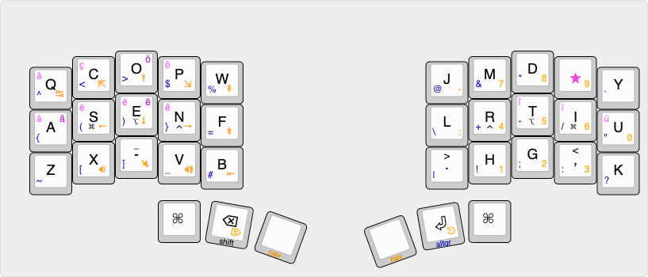
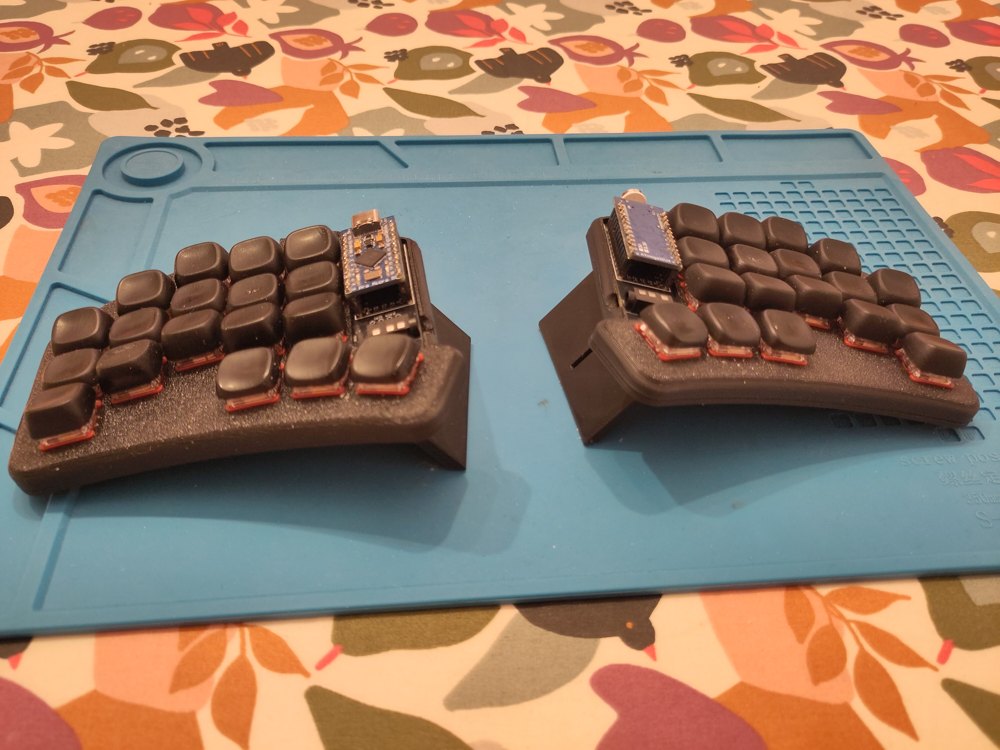
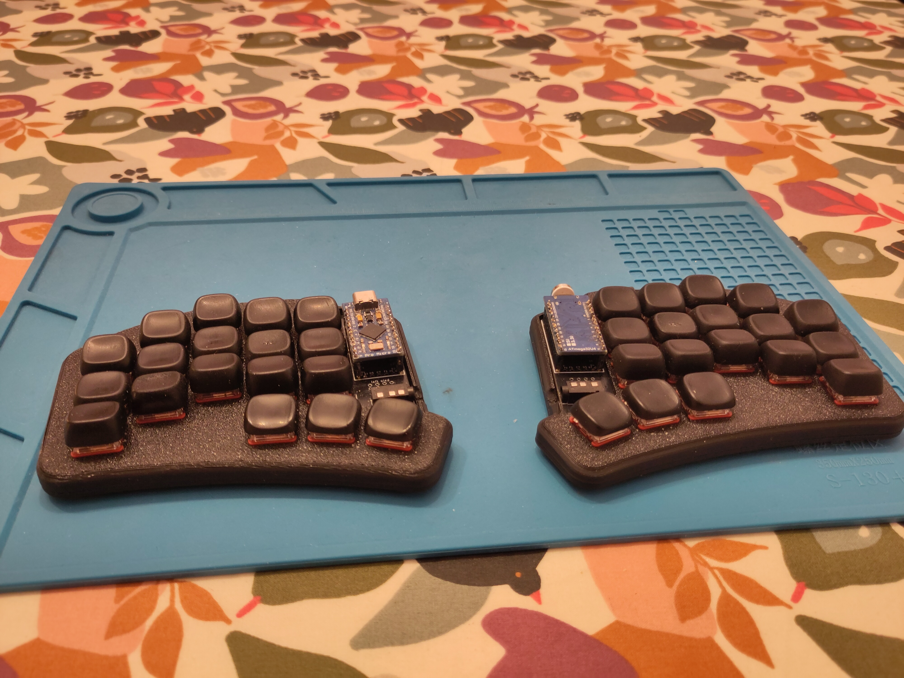

# dweeep qmk firmware

## What's this?

This repo is my customization of the design of the dweeep keyboard by Sadek Baroudi: https://github.com/sadekbaroudi/sweep36

Here you will find:

- The QMK configuration with a regular qwerty layout and an ergol layout (your computer needs to be in extended Qwerty mode)
- The case model I use, both STL and Freecad model sources. The top part was designed with Fusion360 though.

The ergo-l layout:

What it looks like:

